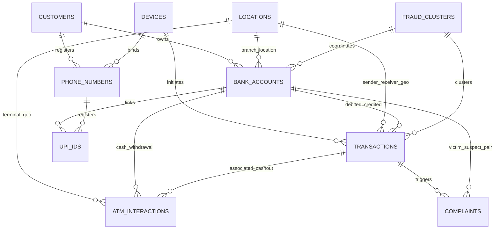

# Synthetic Cybercrime Intelligence & Financial Transaction Dataset
> **Smart India Hackathon (SIH) Evaluation Dataset**  
> *Production-Oriented Simulation of NCRP/1930 Cyber Fraud Complaints, Indian Banking Rails, and Multi-Hop Mule Networks*

---

## 1. Compliance & Non-Disclosure Notice
> [!IMPORTANT]
> **STRICT SYNTHETIC DATA MANDATE:**  
> Real NCRP/1930 citizen complaint records, live Indian bank transaction feeds (UPI/IMPS/NEFT), and law enforcement case files are restricted by legal, national security, and privacy regulations.  
> **This dataset is 100% synthetically generated.** No real personal identity (Aadhaar, PAN, real names), bank account numbers, phone numbers, or actual citizen complaints exist in this repository. All entities are deterministically generated pseudo-records modeled after genuine operational structures.

---

## 2. Directory Layout & File Formats

Datasets are exported simultaneously as both **CSV** (for human inspection, database imports, and quick CSV tools) and **Apache Parquet** (for high-performance columnar analytics, PySpark, Polars, and DuckDB).

```text
data/synthetic/
├── accounts/
│   ├── bank_accounts.csv
│   └── bank_accounts.parquet
├── complaints/
│   ├── complaints.csv
│   └── complaints.parquet
├── entities/
│   ├── atm_interactions.csv
│   ├── atm_interactions.parquet
│   ├── customers.csv
│   ├── customers.parquet
│   ├── devices.csv
│   ├── devices.parquet
│   ├── locations.csv
│   ├── locations.parquet
│   ├── phone_numbers.csv
│   ├── phone_numbers.parquet
│   ├── upi_ids.csv
│   └── upi_ids.parquet
├── fraud_clusters/
│   ├── fraud_clusters.csv
│   └── fraud_clusters.parquet
└── transactions/
    ├── transactions.csv
    └── transactions.parquet
```

---

## 3. Entity Relationship Diagram (Referential Integrity Chain)

Every generated complaint is referentially bound to an underlying transaction, account, UPI VPA, phone number, customer persona, and hardware device.



---

## 4. Dataset Scaling Profiles

Dataset scale can be configured via `--scale` parameter:

| Profile | Target Transactions | Customers | Bank Accounts | UPI IDs | Devices | Complaints | Fraud Clusters | ATM Interactions |
|:---:|:---:|:---:|:---:|:---:|:---:|:---:|:---:|:---:|
| **`10K`** (Default) | ~11,000 | 1,500 | 2,000 | 2,500 | 1,600 | 850 | 35 | 1,200 |
| **`50K`** | ~55,000 | 7,500 | 10,000 | 12,500 | 8,000 | 3,800 | 140 | 5,500 |
| **`100K`** | ~110,000 | 15,000 | 20,000 | 25,000 | 16,000 | 7,500 | 280 | 11,000 |
| **`500K`** | ~550,000 | 75,000 | 100,000 | 125,000 | 80,000 | 36,000 | 1,200 | 55,000 |

### Execution Commands:
```bash
# Generate 10K dataset (CSV and Parquet)
python3 data/generators/synthetic_generator.py --scale 10K --format both

# Generate 50K dataset
python3 data/generators/synthetic_generator.py --scale 50K --format both

# Generate 100K dataset
python3 data/generators/synthetic_generator.py --scale 100K --format both

# Generate 500K production scale dataset
python3 data/generators/synthetic_generator.py --scale 500K --format both
```

---

## 5. Complete Field-by-Field Data Dictionary

### 5.1 Bank Accounts (`data/synthetic/accounts/bank_accounts.*`)
Primary ledger of simulated Indian banking accounts.

| Field Name | Data Type | Nullable | Description / Allowable Values | Synthetic Example |
|---|---|---|---|---|
| `account_number` | String | NO | Primary key account number (Format: `SYN` + 10 digits) | `SYN1000000042` |
| `customer_id` | String | NO | Foreign key referencing `customers.customer_id` | `CUST_0000042` |
| `bank_name` | String | NO | Commercial banking institution name | `State Bank of Synth` |
| `ifsc_code` | String | NO | 11-character Indian Financial System Code | `SYNB000109` |
| `branch_name` | String | NO | Local branch denomination | `Mumbai Branch` |
| `account_type` | String | NO | `SAVINGS`, `CURRENT`, `JAN_DHAN`, `SALARY` | `SAVINGS` |
| `opening_date` | String | NO | Account creation date (YYYY-MM-DD) | `2023-02-01` |
| `current_balance`| Float | NO | Account balance in INR | `48250.00` |
| `is_mule` | Boolean | NO | Ground truth flag: `True` if implicated in mule operations | `True` |
| `mule_tier` | Integer | NO | `0` = Clean citizen account<br>`1` = Layer 1 (Victim-facing receiver mule)<br>`2` = Layer 2 (Distributor / Layering mule)<br>`3` = Layer 3 (Consolidator / Cash-out mule) | `1` |
| `cluster_id` | String | NO | Foreign key referencing `fraud_clusters.cluster_id` or `NONE` | `CLUSTER_0004` |
| `status` | String | NO | `ACTIVE`, `WATCHLIST`, `FROZEN`, `DORMANT` | `WATCHLIST` |
| `location_id` | String | NO | Foreign key referencing `locations.location_id` | `LOC_00012` |
| `primary_device_id`| String | NO | Hardware device used for initial mobile registration | `DEV_0000042` |
| `primary_upi_id` | String | YES | Default registered VPA handle | `ajay.sharma.82@synaxis` |

---

### 5.2 Transactions (`data/synthetic/transactions/transactions.*`)
Ledger of financial movements across Indian payment rails.

| Field Name | Data Type | Nullable | Description / Allowable Values | Synthetic Example |
|---|---|---|---|---|
| `transaction_id` | String | NO | Primary key transaction reference | `TXN_00000128` |
| `sender_account_number` | String | NO | Originating account (`bank_accounts.account_number`) | `SYN1000000018` |
| `receiver_account_number` | String | NO | Beneficiary account (`bank_accounts.account_number` or `N/A` for ATM cashout) | `SYN1000000084` |
| `sender_upi_id` | String | NO | Sender UPI handle or `N/A` if non-UPI rail | `rahul.verma.22@synsbi` |
| `receiver_upi_id` | String | NO | Receiver UPI handle or `N/A` if non-UPI rail | `mule.84@synaxis` |
| `sender_device_id` | String | NO | Terminal device initiating payment or `N/A` | `DEV_0000018` |
| `receiver_device_id` | String | NO | Beneficiary device or `N/A` | `DEV_0000084` |
| `sender_location_id` | String | NO | Geographic origin of sender (`locations.location_id`) | `LOC_00008` |
| `receiver_location_id` | String | NO | Geographic destination of receiver (`locations.location_id`) | `LOC_00002` |
| `transaction_type` | String | NO | `TRANSFER`, `CASH_IN`, `CASH_OUT`, `PAYMENT` | `TRANSFER` |
| `payment_channel` | String | NO | `UPI`, `IMPS`, `NEFT`, `RTGS`, `ATM` | `UPI` |
| `amount` | Float | NO | Transaction value in Indian Rupees (INR) | `50000.00` |
| `timestamp` | Timestamp | NO | ISO-8601 UTC timestamp of execution | `2024-08-15T10:14:32Z` |
| `is_fraud` | Boolean | NO | Ground-truth flag: `True` if part of fraudulent flow | `True` |
| `pattern_type` | String | NO | Ground-truth behavioral pattern label (See Section 6) | `RAPID_VELOCITY` |
| `cluster_id` | String | NO | Syndicate identifier or `NONE` | `CLUSTER_0002` |

---

### 5.3 Cybercrime Complaints (`data/synthetic/complaints/complaints.*`)
Simulated citizen reports filed through the 1930 Helpline and NCRP Portal.

| Field Name | Data Type | Nullable | Description / Allowable Values | Synthetic Example |
|---|---|---|---|---|
| `complaint_id` | String | NO | Unique internal incident identifier | `CMP_0000001` |
| `acknowledgement_no` | String | NO | Citizen tracking number (`NCRP-SYN-2024-XXXXXX`) | `NCRP-SYN-2024-100001` |
| `incident_date` | Timestamp | NO | Timestamp when fraudulent debit occurred | `2024-08-15T10:14:32Z` |
| `reported_date` | Timestamp | NO | Timestamp when citizen contacted 1930 / NCRP | `2024-08-15T14:45:00Z` |
| `reporting_delay_hours` | Integer | NO | Delay between incident and filing (Golden Hour index) | `4` |
| `category` | String | NO | Cybercrime typology (10 categories, see Section 7) | `digital arrest scam` |
| `reported_loss_amount` | Float | NO | Financial loss reported in INR | `480000.00` |
| `narrative_synthetic` | Text | NO | Synthesized narrative explicitly referencing underlying entities | Narrative description |
| `victim_account_number` | String | NO | Complainant's debited account | `SYN1000000018` |
| `suspect_account_number` | String | NO | Beneficiary account where funds arrived | `SYN1000000084` |
| `suspect_upi_id` | String | NO | Suspect VPA or `N/A` | `mule.84@synaxis` |
| `suspect_phone_number` | String | NO | Suspect calling/WhatsApp number | `+919876543210` |
| `initial_transaction_id` | String | NO | Direct FK linking to primary debit in `transactions` | `TXN_00000128` |
| `suspect_device_id` | String | NO | Hardware device used by suspect | `DEV_0000084` |
| `victim_state` | String | NO | Complainant state of residence | `Maharashtra` |
| `suspect_state` | String | NO | Suspect account state of branch | `Haryana` |
| `cluster_id` | String | NO | Fraud syndicate ID | `CLUSTER_0002` |
| `ground_truth_category` | String | NO | Ground truth verification label | `digital arrest scam` |

---

### 5.4 Customers (`data/synthetic/entities/customers.*`)
Underlying synthetic citizen and persona records.

| Field Name | Data Type | Nullable | Description / Allowable Values | Synthetic Example |
|---|---|---|---|---|
| `customer_id` | String | NO | Primary key identifier | `CUST_0000001` |
| `synthetic_name` | String | NO | Full synthesized Indian name | `Aarav Sharma` |
| `dob` | Date | NO | Date of birth (YYYY-MM-DD) | `1985-06-14` |
| `gender` | String | NO | `M`, `F` | `M` |
| `occupation` | String | NO | Profession / employment profile | `Software Engineer` |
| `annual_income_bracket`| String | NO | `< 3 LPA`, `3 - 7 LPA`, `7 - 15 LPA`, `15 - 30 LPA`, `> 30 LPA` | `7 - 15 LPA` |
| `risk_category` | String | NO | `LOW`, `MEDIUM`, `HIGH`, `CRITICAL` | `LOW` |
| `is_mule_suspect` | Boolean | NO | `True` if flagged as mule persona | `False` |
| `cluster_id` | String | NO | Cluster membership or `NONE` | `NONE` |
| `created_at` | Timestamp | NO | Date customer profile created | `2023-01-15T00:00:00Z` |

---

### 5.5 Devices (`data/synthetic/entities/devices.*`)
Mobile and terminal hardware fingerprints.

| Field Name | Data Type | Nullable | Description / Allowable Values | Synthetic Example |
|---|---|---|---|---|
| `device_id` | String | NO | Primary key device identifier | `DEV_0000001` |
| `imei_hash` | String | NO | 16-character SHA-256 hash of IMEI | `a7b9c482f019de51` |
| `device_model` | String | NO | Brand and model name | `Redmi Note 12 Pro` |
| `os_version` | String | NO | Operating system | `Android 13` |
| `ip_address` | String | NO | Public synthetic IP address | `49.36.142.88` |
| `is_emulator` | Boolean | NO | `True` if Nox/BlueStacks emulator instance | `False` |
| `is_rooted_jailbroken` | Boolean | NO | `True` if rooted device | `False` |
| `is_shared_device` | Boolean | NO | `True` if accessed by multiple distinct customers | `False` |
| `primary_location_id` | String | NO | Foreign key referencing `locations.location_id` | `LOC_00004` |
| `created_at` | Timestamp | NO | Device initial observation date | `2023-04-15T00:00:00Z` |

---

### 5.6 Phone Numbers (`data/synthetic/entities/phone_numbers.*`)
Simulated SIM card and MSISDN directory.

| Field Name | Data Type | Nullable | Description / Allowable Values | Synthetic Example |
|---|---|---|---|---|
| `phone_number` | String | NO | Indian MSISDN (`+9198XXXXXXXX`) | `+919874829104` |
| `operator` | String | NO | `Jio 5G`, `Airtel India`, `Vodafone Idea (Vi)`, `BSNL` | `Jio 5G` |
| `circle` | String | NO | Telecom circle (`MH`, `DL`, `KA`, `TS`, `RJ`, etc.) | `MH` |
| `customer_id` | String | NO | Foreign key referencing `customers.customer_id` | `CUST_0000001` |
| `device_id` | String | NO | Foreign key referencing `devices.device_id` | `DEV_0000001` |
| `sim_activation_date` | Date | NO | Date of KYC SIM activation | `2023-01-10` |
| `is_virtual_voip` | Boolean | NO | `True` if virtual / VoIP burner number | `False` |
| `is_suspect` | Boolean | NO | Flagged by cyber cell watchlist | `False` |
| `cluster_id` | String | NO | Associated syndicate ID | `NONE` |

---

### 5.7 UPI IDs (`data/synthetic/entities/upi_ids.*`)
Virtual Payment Addresses (VPAs).

| Field Name | Data Type | Nullable | Description / Allowable Values | Synthetic Example |
|---|---|---|---|---|
| `vpa` | String | NO | Virtual Payment Address (`user@handle`) | `aarav.sharma.42@synaxis` |
| `account_number` | String | NO | Foreign key referencing `bank_accounts.account_number` | `SYN1000000001` |
| `linked_phone_number` | String | NO | Foreign key referencing `phone_numbers.phone_number` | `+919874829104` |
| `psp_handle` | String | NO | Payment service provider handle (`@synaxis`, `@synsbi`, etc.) | `@synaxis` |
| `creation_date` | Date | NO | VPA creation date | `2023-03-01` |
| `is_suspicious` | Boolean | NO | Ground-truth flag for high-risk VPA | `False` |
| `status` | String | NO | `ACTIVE`, `BLOCKED` | `ACTIVE` |

---

### 5.8 Locations (`data/synthetic/entities/locations.*`)
Indian geographical reference table including known cyber threat hotzones.

| Field Name | Data Type | Nullable | Description / Allowable Values | Synthetic Example |
|---|---|---|---|---|
| `location_id` | String | NO | Primary key location identifier | `LOC_00001` |
| `state` | String | NO | Indian State / Union Territory | `Jharkhand` |
| `district` | String | NO | Administrative district | `Jamtara` |
| `city` | String | NO | City / Village / Sector | `Jamtara` |
| `pincode` | String | NO | 6-digit Indian Postal Code | `815351` |
| `latitude` | Float | NO | Latitude coordinate | `23.9614` |
| `longitude` | Float | NO | Longitude coordinate | `86.8016` |
| `is_cyber_hotspot` | Boolean | NO | `True` for benchmark cyber crime hubs | `True` |
| `hotspot_cluster_name`| String | NO | Designation (`Jamtara-Karmatanr Hub`, `Mewat-Nuh Region`, etc.) | `Jamtara-Karmatanr Hub` |

---

### 5.9 ATM Interactions (`data/synthetic/entities/atm_interactions.*`)
Physical terminal transactions and rapid cash-out events.

| Field Name | Data Type | Nullable | Description / Allowable Values | Synthetic Example |
|---|---|---|---|---|
| `atm_interaction_id` | String | NO | Primary key identifier | `ATM_0000001` |
| `account_number` | String | NO | Withdrawing account (`bank_accounts.account_number`) | `SYN1000000042` |
| `atm_id` | String | NO | Physical terminal identifier (`ATM_SYN_XXXX`) | `ATM_SYN_4921` |
| `location_id` | String | NO | Terminal location (`locations.location_id`) | `LOC_00001` |
| `timestamp` | Timestamp | NO | Withdrawal execution timestamp | `2024-08-15T10:19:12Z` |
| `amount` | Float | NO | Dispensed cash in INR | `40000.00` |
| `status` | String | NO | `SUCCESS`, `FAILED` | `SUCCESS` |
| `rapid_cashout_flag` | Boolean | NO | `True` if cashout executed within 10 mins of fraud credit | `True` |
| `associated_transaction_id`| String| NO | Foreign key linking to cashout entry in `transactions` | `TXN_00007524` |

---

### 5.10 Fraud Clusters (`data/synthetic/fraud_clusters/fraud_clusters.*`)
Identified cybercrime syndicates and coordinated mule rings.

| Field Name | Data Type | Nullable | Description / Allowable Values | Synthetic Example |
|---|---|---|---|---|
| `cluster_id` | String | NO | Primary key identifier (`CLUSTER_XXXX`) | `CLUSTER_0001` |
| `cluster_type` | String | NO | `MULE_RING_CHAIN`, `MANY_TO_ONE_FUNNEL`, `ONE_TO_MANY_SMURFING`, `RAPID_CASHOUT_RING`, `DIGITAL_ARREST_SYNDICATE`, `TASK_SCAM_SYNDICATE` | `MULE_RING_CHAIN` |
| `core_hotspot_id` | String | NO | Anchor geographic hub (`locations.location_id`) | `LOC_00001` |
| `member_account_count`| Integer | NO | Number of coordinated beneficiary accounts | `8` |
| `member_device_count` | Integer | NO | Number of shared phones/emulators | `3` |
| `total_flow_amount` | Float | NO | Cumulative volume laundered through syndicate | `1850000.00` |
| `detected_patterns` | String | NO | Dominant modus operandi signature | `MULE_RING_CHAIN` |
| `risk_severity` | String | NO | `HIGH`, `CRITICAL` | `CRITICAL` |

---

## 6. Ground-Truth Suspicious Patterns (Transaction Typologies)

| Pattern Key | Description | Detection Signature |
|---|---|---|
| `NORMAL` | Standard peer-to-peer, bill payments, and cash withdrawals. | Baseline velocity, typical balances. |
| `RAPID_VELOCITY` | Rapid pass-through: Inflow from victim immediately dispatched downstream. | Delta time between credit and debit < 180 seconds. |
| `MULE_CHAIN_HOP1` | Hop 1: Victim transfers funds into Layer-1 receiver account. | First receiver in multi-hop chain. |
| `MULE_CHAIN_HOP2` | Hop 2: Layer-1 mule splits/forwards funds to Layer-2 distributor. | Second-tier forwarding account. |
| `MULE_CHAIN_HOP3` | Hop 3: Layer-2 mule forwards funds to Layer-3 cash-out consolidator. | Final banking hop before off-ramp. |
| `MANY_TO_ONE_FAN_IN` | Funnel account: Multiple victims transfer funds to single aggregator account. | High in-degree ratio within 1-2 hours. |
| `ONE_TO_MANY_FAN_OUT`| Smurfing: Large lump sum broken into small transfers below reporting limits. | High out-degree ratio, structured amounts. |
| `RAPID_CASHOUT` | ATM drain: Account balance immediately emptied at physical ATM after credit. | ATM `CASH_OUT` within 2-10 minutes of credit. |
| `UNUSUAL_AMOUNT_TESTING`| Micro-probe: Test transaction of ₹1 or ₹5 followed by complete balance drain. | Micro credit followed by 99% drain in < 90 seconds. |
| `REPEATED_BURST` | Burst transfers: Repeated identical round amounts in quick succession. | Bypassing single-transaction UPI limit. |
| `GEOGRAPHIC_ANOMALY` | Spatial anomaly: Funds sent from distant state collected in cyber hotzone. | Victim in Maharashtra, receiver/ATM in Jamtara/Mewat. |

---

## 7. Cybercrime Complaint Typologies (10 Categories)

1. **UPI fraud**: Fake QR codes, reverse-debit deception, marketplace buyer impersonation.
2. **KYC fraud**: Electricity disconnection scares, APK screen-share downloads, bank PAN update threats.
3. **Investment fraud**: Fake WhatsApp/Telegram VIP stock groups, counterfeit trading apps, high-yield crypto ponzis.
4. **Fake customer care**: Google sponsored fraud numbers for airlines, courier, and e-wallets.
5. **Phishing**: Fake tax refund portals, credit card reward expiry links, netbanking credential harvesting.
6. **Loan scam**: Instant loan app extortion, contacts permissions harvesting, morphed photo blackmail.
7. **Job scam**: Telegram part-time rating tasks, prepaid YouTube video likes, merchant deposit traps.
8. **Impersonation**: Fake FedEx courier drug seizure, TRAI mobile disconnection threats, fake police calls.
9. **Digital arrest scam**: Simulated 12-24 hour Skype video arrest by impostors in CBI/Police uniform demanding escrow transfer.
10. **Online shopping fraud**: Heavily discounted flagship electronics on Instagram/OLX, fake tracking numbers, non-delivery.

---

## 8. Validation and Verification

Run the automated integrity validation script:
```bash
# Validate CSV datasets
python3 data/validators/validate_referential_integrity.py csv

# Validate Parquet datasets
python3 data/validators/validate_referential_integrity.py parquet
```
Or execute the automated Pytest suite:
```bash
pytest tests/data/test_synthetic_integrity.py -v
```
