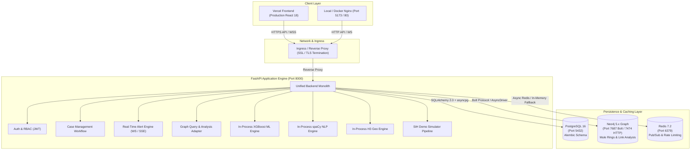

# CyberShield-Intel: Production Deployment & Operations Guide
**Comprehensive Multi-Service Architecture, Dockerization, Database Lifecycle & Cloud Deployment**

---

## 1. System Architecture

CyberShield-Intel is architected as a production-oriented, modular multi-service cybercrime intelligence platform. For optimal operational simplicity, minimal container inter-communication overhead, and sub-millisecond scoring latency, the core analytical engines (**Machine Learning / XGBoost risk inference**, **spaCy NLP entity extraction**, and **H3 geospatial cash-out prediction**) run natively in-process within the FastAPI backend container.



---

## 2. Required Services & Topology

| Service | Technology | Port(s) | Primary Responsibility |
|---|---|---|---|
| **backend** | Python 3.12 / FastAPI / Uvicorn | `8000` | REST API, WebSockets, Case Management, Alert Engine, In-process ML/NLP/Geo |
| **frontend** | React 18 / TypeScript / Vite / NGINX | `5173` (dev) / `80` (prod) | High-contrast Dark-Mode Investigation Dashboard & Intelligence Views |
| **postgres** | PostgreSQL 16 Alpine | `5432` | Relational store for Users, Roles, Banks, Accounts, ATMs, Complaints, Transactions, Cases, Evidence, Notes, Timeline Events, Alerts, Audit Logs |
| **neo4j** | Neo4j 5.18.0 Community / Aura | `7474` (HTTP), `7687` (Bolt) | Multi-hop transaction paths, mule ring detection, shared identifier linking |
| **redis** | Redis 7.2 Alpine | `6379` | In-memory message broker, real-time alert broadcasts, rate limiting |

> [!NOTE]
> **Why No Separate ML/NLP/Geo Containers?**
> The ML, NLP, and Geo pipelines were intentionally unified into the modular backend process in Phase 11B. This design eliminates unnecessary container network serialization, removes inter-service HTTP latencies, simplifies Docker orchestration, and ensures all risk scores and geo-coordinates are computed deterministically in memory.

---

## 3. Prerequisites

- **Docker Engine**: Version 24.0 or higher
- **Docker Compose**: Version 2.20 or higher
- **Host Tools (for non-containerized development)**:
  - Python 3.12+
  - Node.js 20+ and npm
  - `curl` and `git`

---

## 4. Environment Configuration

All deployment configurations are controlled through environment variables. Use `.env.example` as a template:

```bash
cp .env.example .env
```

### Complete Environment Matrix

| Variable | Type | Default | Production Requirement |
|---|---|---|---|
| `ENVIRONMENT` | string | `development` | Set to `production` |
| `DEBUG` | boolean | `True` | Set to `False` |
| `APP_NAME` | string | `CyberShield-Intel` | Platform identifier |
| `API_V1_PREFIX` | string | `/api/v1` | Base API prefix |
| `BACKEND_HOST` | string | `127.0.0.1` | Local host binding |
| `BACKEND_PORT` | integer | `8000` | Internal server port |
| `ALLOWED_CORS_ORIGINS` | JSON list / CSV | `["http://localhost:5173", ...]` | **CRITICAL**: Set to exact Vercel frontend URL(s). Wildcard `*` will fail startup! |
| `JWT_SECRET_KEY` | string | *(dev key)* | **CRITICAL**: Minimum 32-character CSPRNG secret. Never commit! |
| `JWT_ALGORITHM` | string | `HS256` | Cryptographic signature algorithm |
| `ACCESS_TOKEN_EXPIRE_MINUTES` | integer | `60` | Token validity duration |
| `POSTGRES_USER` | string | `cyber_admin` | Database username |
| `POSTGRES_PASSWORD` | string | `cyber_dev_password_123!` | Secure DB password |
| `POSTGRES_DB` | string | `cyber_intelligence_db` | Relational database name |
| `DATABASE_URL` | string | `postgresql+asyncpg://...` | Connection URI with `+asyncpg` driver |
| `NEO4J_URI` | string | `bolt://localhost:7687` | Bolt URI (`neo4j+s://...` for Aura) |
| `NEO4J_USER` | string | `neo4j` | Graph username |
| `NEO4J_PASSWORD` | string | `cyber_graph_password_123!` | Graph password |
| `REDIS_URL` | string | `redis://localhost:6379/0` | Redis connection URI |
| `SYNTHETIC_DATA_ONLY` | boolean | `True` | Statutory synthetic compliance guardrail |
| `AUTO_SEED` | boolean | `true` | Auto-seed database with synthetic records on clean startup |
| `VITE_API_BASE_URL` | string | `http://localhost:8000/api/v1` | Public API base URL consumed by Vite frontend |
| `VITE_WS_ALERT_URL` | string | `ws://localhost:8000/alerts/ws` | WebSocket URL for real-time alert feed |

---

## 5. Local Docker Deployment (All Services)

To spin up the entire multi-service stack from scratch:

```bash
# 1. Validate docker compose specification
docker compose config

# 2. Build images and start all containers in detached mode
docker compose up -d --build

# 3. Inspect health status of all running containers
docker compose ps

# 4. Tail logs from backend container to verify Alembic migrations
docker compose logs -f backend
```

Once running, the application services are available at:
- **Investigation Dashboard**: [http://localhost:5173](http://localhost:5173)
- **FastAPI OpenAPI Interactive Docs**: [http://localhost:8000/api/v1/docs](http://localhost:8000/api/v1/docs)
- **Backend Health Check**: [http://localhost:8000/health](http://localhost:8000/health)
- **Backend Readiness Probe**: [http://localhost:8000/health/ready](http://localhost:8000/health/ready)
- **Neo4j Browser**: [http://localhost:7474](http://localhost:7474) (Username: `neo4j`, Password: `cyber_graph_password_123!`)

To cleanly shut down the stack:
```bash
docker compose down
# Or to wipe volumes and perform a 100% clean-machine test:
docker compose down -v
```

---

## 6. Database Initialization & Alembic Migrations

The database lifecycle is fully automated and idempotent.

### Automated Container Lifecycle
When the backend container starts via `docker/entrypoint.sh`:
1. It loops until PostgreSQL is accepting connections (up to 45 seconds).
2. It executes `alembic upgrade head`, ensuring all 13+ relational tables, foreign key constraints, and indices exist.
3. If `AUTO_SEED=true` and the database contains 0 users, it seeds the synthetic intelligence dataset.
4. If Neo4j is available, it applies graph schema constraints idempotently.
5. It launches Uvicorn.

### Manual Database Management Commands
If running outside Docker or debugging database schemas:

```bash
# View current database revision
alembic current

# View revision history
alembic history --verbose

# Apply all pending migrations to head
alembic upgrade head

# Roll back by one migration revision
alembic downgrade -1

# Seed synthetic intelligence records manually
python -m backend.app.db.seeds
```

---

## 7. Neo4j Graph Initialization

The graph database enforces uniqueness on core identifiers to prevent duplicate nodes during ingestion:

### Cypher Constraints & Indexes
Defined in `docker/neo4j-init.cypher` and `graph/schema/constraints.py`:
- `Account(account_number)` — Unique
- `Customer(customer_id)` — Unique
- `Transaction(transaction_id)` — Unique
- `Complaint(acknowledgement_no)` — Unique
- `UPI(vpa)` — Unique
- `Phone(phone_number)` — Unique
- `Device(device_id)` — Unique
- `Bank(bank_code)` — Unique
- `ATM(atm_id)` — Unique
- `Location(location_id)` — Unique

To execute graph schema setup manually:
```bash
python -c "import asyncio; from graph.schema.constraints import apply_graph_schema; from backend.app.db.neo4j import get_neo4j_driver; asyncio.run(apply_graph_schema(get_neo4j_driver()))"
```

---

## 8. Health Checks & Diagnostics

The platform provides multi-tier health and diagnostic probes for load balancers and container orchestrators:

### 1. Liveness Probe (`GET /health`)
Verifies the HTTP application process is responsive.
```bash
curl -i http://localhost:8000/health
```
```json
{
  "status": "healthy",
  "app": "CyberShield-Intel",
  "version": "0.1.0",
  "mode": "SYNTHETIC_DEVELOPMENT",
  "timestamp_compliance": "Synthetic data mode enforced"
}
```

### 2. Readiness Probe (`GET /health/ready`)
Verifies that downstream persistence dependencies (PostgreSQL, Neo4j, Redis) are connected and operational.
```bash
curl -i http://localhost:8000/health/ready
```
```json
{
  "status": "ready",
  "services": {
    "postgresql": "connected",
    "neo4j": "connected",
    "redis": "connected"
  },
  "environment": "development"
}
```

### 3. Service-Specific Subsystem Health Checks
- `GET /risk/health`: XGBoost transaction risk model status
- `GET /nlp/health`: spaCy statistical NER and category classifier status
- `GET /geo/health`: H3 geospatial index and ATM directory status

---

## 9. Frontend Production Build & Hosting

### Building Frontend Artifacts
```bash
cd frontend
npm install
npm run build
```
The output is written to `frontend/dist/`.

### Serving with NGINX in Docker
The frontend Dockerfile supports a production multi-stage target:
```bash
docker build -t cybershield-frontend:prod --target production -f docker/Dockerfile.frontend .
docker run -p 80:80 cybershield-frontend:prod
```

### Hosting on Vercel
See [docs/VERCEL_DEPLOYMENT.md](file:///Users/ronitsingh/Anti/SIH/docs/VERCEL_DEPLOYMENT.md) for full instructions on configuring Vercel root directory, environment variables, SPA rewrites, and CORS.

---

## 10. CORS & Reverse Proxy Networking

When the frontend and backend are hosted on different origins (e.g., Frontend on Vercel, Backend on a cloud VM/container platform):

1. **Configure CORS in Backend**:
   ```bash
   ALLOWED_CORS_ORIGINS=["https://cybershield-intel.vercel.app","http://localhost:5173"]
   ```
   > [!CAUTION]
   > Do NOT use `*` as an allowed origin in production. The backend explicitly rejects startup with wildcard origins when `ENVIRONMENT=production`.

2. **WebSocket Reverse Proxy Settings**:
   Reverse proxies (NGINX, Cloudflare, Traefik) must pass WebSocket upgrade headers:
   ```nginx
   location /alerts/ {
       proxy_pass http://backend:8000/alerts/;
       proxy_http_version 1.1;
       proxy_set_header Upgrade $http_upgrade;
       proxy_set_header Connection "upgrade";
       proxy_set_header Host $host;
       proxy_buffering off;
       proxy_read_timeout 86400s;
   }
   ```

3. **Server-Sent Events (SSE)**:
   The backend emits `X-Accel-Buffering: no` on `/alerts/sse`. Ensure intermediate proxies do not buffer HTTP chunked responses.

---

## 11. Troubleshooting Guide

| Issue | Likely Cause | Resolution |
|---|---|---|
| `pg_isready` fails / DB connection timeout | PostgreSQL container initializing or invalid credentials | Verify `DATABASE_URL` matches `POSTGRES_USER` / `POSTGRES_PASSWORD`. Ensure port 5432 is not occupied on host. |
| `FATAL: Wildcard CORS origin ('*') is strictly prohibited in production` | Misconfigured `ALLOWED_CORS_ORIGINS` | Update `ALLOWED_CORS_ORIGINS` to contain specific domain(s) instead of `*`. |
| spaCy model not found in container | Missing `en_core_web_sm` model download | Verify `Dockerfile.backend` contains `RUN python -m spacy download en_core_web_sm`. |
| WebSocket connection failed (`ERR_CONNECTION_REFUSED`) | Frontend looking at `127.0.0.1` while hosted externally | Set `VITE_WS_ALERT_URL=wss://<backend-domain>/alerts/ws` in Vercel environment variables. |
| Neo4j authentication failure | `NEO4J_AUTH` mismatch | Ensure `NEO4J_USER` and `NEO4J_PASSWORD` in backend environment match `NEO4J_AUTH` in Neo4j service. |

---

## 12. Security & Compliance Checklist

- [ ] `JWT_SECRET_KEY` generated using cryptographically strong randomness (`secrets.token_hex(32)`).
- [ ] Non-root execution verified inside backend container (`appuser`).
- [ ] No database credentials or secrets checked into source control.
- [ ] HTTP Security Headers enabled (`X-Content-Type-Options: nosniff`, `X-Frame-Options: DENY`, `Strict-Transport-Security`, `CSP`).
- [ ] Synthetic data guardrails enforced (`SYNTHETIC_DATA_ONLY=True`).
- [ ] Zero unhandled 500 error leaks; all errors sanitized through `app.core.sanitizer`.
