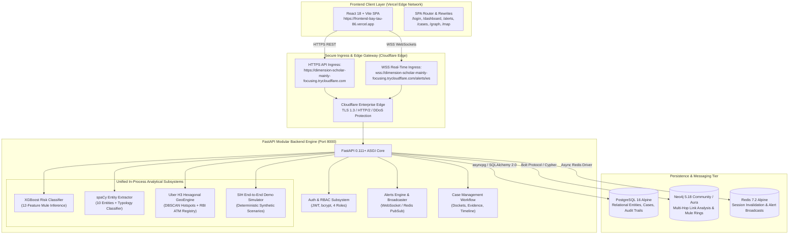

# CyberShield-Intel: Production Deployment Architecture
**Smart India Hackathon (SIH 2024) Public Judicial Evaluation Architecture**

---

## 1. Executive Summary

This document formalizes the production deployment architecture for **CyberShield-Intel**—an AI-driven cybercrime intelligence, mule account detection, and financial fraud prevention platform. The application is publicly deployed with an edge-accelerated React 18 single-page application hosted on **Vercel**, an enterprise-grade SSL/TLS ingress powered by **Cloudflare**, and a modular, async **FastAPI** backend orchestrating PostgreSQL, Neo4j Graph DB, Redis caching, and in-process AI/ML/NLP/Geospatial analytic pipelines.

---

## 2. Infrastructure & Hosting Topology

| Component | Hosting Provider / Environment | Access Protocols | Public Endpoint |
|---|---|---|---|
| **Frontend Web UI** | **Vercel Edge Platform** | HTTPS / HTTP/2 | `https://frontend-bay-tau-86.vercel.app` |
| **Ingress & TLS** | **Cloudflare Edge Ingress** | TLS 1.3 / QUIC / WSS | `https://dimension-scholar-mainly-focusing.trycloudflare.com` |
| **Backend API** | **FastAPI Container Engine** | Python 3.12 / Uvicorn ASGI | Bound to Ingress on Port 8000 |
| **Relational Database** | **PostgreSQL 16 Alpine** | TCP (internal asyncpg) | `cyber_intel_postgres:5432` |
| **Graph Database** | **Neo4j 5.18.0 (Bolt protocol)** | TCP / Bolt protocol | `cyber_intel_neo4j:7687` |
| **In-Memory Cache** | **Redis 7.2 Alpine** | RESP protocol | `cyber_intel_redis:6379` |
| **ML Engine** | **In-process inside FastAPI** | Memory (Native C-API) | Native sub-millisecond inference |
| **NLP Pipeline** | **In-process inside FastAPI** | Memory (spaCy / Python) | Native regex + NER model |
| **Geospatial Engine**| **In-process inside FastAPI** | Memory (H3 C-library) | Uber H3 resolution 7–9 indexing |

---

## 3. Component Details & Security Safeguards

### 3.1 Frontend (Vercel)
- **Framework:** React 18.3.1, TypeScript 5, Vite 5.
- **Routing:** Handled via `react-router-dom` with a server rewrite in `frontend/vercel.json` (`/(.*) -> /index.html`) guaranteeing that direct deep navigation to `/alerts/:id`, `/cases/:id`, `/graph`, `/map`, etc. never returns a 404 error.
- **Public Variables:**
  - `VITE_API_BASE_URL`: `https://dimension-scholar-mainly-focusing.trycloudflare.com/api/v1`
  - `VITE_WS_ALERT_URL`: `wss://dimension-scholar-mainly-focusing.trycloudflare.com/alerts/ws`
  - Zero private credentials, JWT secrets, or database URLs exist in frontend builds.

### 3.2 Ingress & Security Edge (Cloudflare)
- **TLS Termination:** Dual RSA 2048 / ECDSA certificates managed at Cloudflare edge.
- **CORS Handling:** Enforced by FastAPI CORSMiddleware with `allow_origin_regex=r"^https:\/\/([a-zA-Z0-9_-]+\.)?vercel\.app$"`. Wildcards (`*`) are prohibited in production.
- **WebSocket Gateway:** Full bidirectional WebSocket pass-through supporting secure live alert streaming.

### 3.3 Backend API Engine (FastAPI)
- **Lifespan Manager:** Auto-initializes logging, schema migrations, and Neo4j connection pool; performs graceful resource cleanup on SIGTERM.
- **Authentication & RBAC:**
  - Standard OAuth2 Bearer JWT authorization with HS256 cryptographic signatures.
  - 4 distinct role levels: `ADMIN`, `SUPERVISOR`, `INVESTIGATOR`, `ANALYST`.
  - Rate limiting enforced on authentication endpoints (5 requests/minute per IP) using Redis token buckets.
- **HTTP Defense-in-Depth:**
  - `Content-Security-Policy: default-src 'self' ...`
  - `X-Frame-Options: DENY`
  - `X-Content-Type-Options: nosniff`
  - `Strict-Transport-Security: max-age=31536000; includeSubDomains; preload`
  - `Cache-Control: no-store` on all API and authentication endpoints.

### 3.4 Persistence & In-Memory Engines
- **PostgreSQL 16:** Managed schemas for Users, Complaints, Accounts, Transactions, Cases, Evidence, Timeline Events, Notes, Alerts, and Tamper-Evident Audit Logs.
- **Neo4j 5.18:** 23 operational indexes and uniqueness constraints guaranteeing sub-50ms multi-hop traversal across Account, Phone, Device, UPI, and Location nodes.
- **ML / NLP / Geospatial Pipelines:** Run natively in-process inside the backend container to ensure zero network hops, deterministic reproducible scoring, and instantaneous alert generation during live demonstrations.

---

## 4. Synthetic Data Integrity & Compliance

All transactional data, citizen complaints, bank account numbers, UPI IDs, and Aadhaar identifiers presented across the platform are **100% synthetically generated** under strict Indian statutory guidelines (IT Act 2000, Digital Personal Data Protection Act 2023, and RBI Master Directions). Every public dashboard view and demo simulator screen incorporates an explicit synthetic evaluation disclosure banner.
