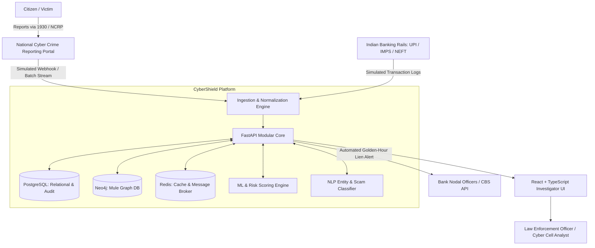

# CyberShield Intel: System Architecture Document
**Production-Oriented Cybercrime Intelligence & Financial Transaction Risk Detection Platform**  
*Smart India Hackathon (SIH) Prototype Specification*

---

## 1. Executive Overview & Problem Context
In cyber financial fraud across India (such as 1930 helpline reports and NCRP portal filings), victim funds typically undergo **rapid multi-layer dispersion** within minutes of the fraudulent debit. Fraudsters utilize layered networks of **mule bank accounts** and **synthetic UPI VPAs** to move stolen capital through 3–5 hops before final cash-out via ATMs, P2P crypto exchanges, or gift cards.

Restricted access to live NCRP complaints and real-time bank transaction feeds mandates that this platform operates with a **strict synthetic data model** for development and hackathon evaluation. The architecture is engineered to seamlessly interchange synthetic feeds with production feeds (e.g. I4C, NPCI, Bank Core Banking Systems) without refactoring the core analytical engines.

---

## 2. High-Level Architecture (C4 Model)

### 2.1 System Context (C4 Level 1)


### 2.2 Container Architecture (C4 Level 2)
The platform is orchestrated as a containerized modular microservice-ready monolith:
1. **Frontend**: React 18, TypeScript, Vite, Dark Cybersecurity Theme, PII Masking.
2. **Backend**: Python 3.12, FastAPI, Pydantic v2, SQLAlchemy 2.0 (Asyncpg).
3. **Graph Engine**: Neo4j 5.x Community/Enterprise with APOC, Bolt Protocol.
4. **Relational Database**: PostgreSQL 16 for structured transactional ledger, complaints, and forensic audit trail.
5. **Cache / Broker**: Redis 7.2 for alert queuing and session token state.
6. **Analytics & NLP**: Scikit-Learn, NetworkX, Regex NER extractors for Indian VPAs and IFSC codes.

---

## 3. Data Tier: Hybrid Relational + Graph Architecture

| Component | Technology | Primary Responsibility |
|---|---|---|
| **Relational Data** | PostgreSQL 16 | ACID-compliant storage for users, complaints, bank account balances, audit logs, and transaction history. |
| **Network Graph** | Neo4j 5.x | Multi-hop link analysis, shared device fingerprints, mule ring community detection (Louvain), and shortest-path cashout tracing. |
| **Volatile State** | Redis 7.2 | Real-time Golden-Hour alert deduplication, rate limiting, and cache for frequently accessed graph queries. |

### 3.1 Graph Ontology
- **Nodes**:
  - `(:Complaint {acknowledgement_no, category, loss_amount, timestamp})`
  - `(:BankAccount {account_number, ifsc, bank_name, risk_score, layer})`
  - `(:UPI_ID {vpa, provider, risk_score})`
  - `(:Phone {phone_number, state, district})`
  - `(:Device {device_id, ip_address})`
  - `(:MuleRing {ring_id, confidence, member_count})`
- **Edges**:
  - `[:TRANSFERRED_TO {amount, timestamp, rail, rrn, velocity_mins}]`
  - `[:LINKED_UPI]`
  - `[:LINKED_PHONE]`
  - `[:ACCESSED_FROM]`
  - `[:ASSOCIATED_WITH_COMPLAINT]`

---

## 4. Multi-Layer Financial Mule Laundering Typology

```
[ Victim Account ] 
       │ (Hop 1: UPI Transfer - e.g. ₹50,000)
       ▼
[ Layer-1 Primary Receiver Mule ] (Zero balance retention, drain in < 5 mins)
       │ (Hop 2: IMPS Split - e.g. ₹48,000)
       ▼
[ Layer-2 Distributing Mule Account ] (Splits funds across multiple sub-mules)
       │ (Hop 3: NEFT / P2P - e.g. ₹46,500)
       ▼
[ Layer-3 Cash-Out / Off-Ramp ] (ATM Withdrawal / Crypto Exchange Deposit)
```

---

## 5. Security & Defense-in-Depth Architecture
1. **Zero Real PII**: Development environment strictly uses synthetic data.
2. **PII Masking**: Frontend automatically obscures phone numbers, accounts, and VPAs in UI tables.
3. **Database Security**:
   - Parameterized queries everywhere (SQLAlchemy ORM + Cypher query params).
   - Principle of Least Privilege: Application connects using non-root database user.
4. **Network & Headers**:
   - Strict CORS whitelist.
   - `X-Content-Type-Options: nosniff`, `X-Frame-Options: DENY`, `Strict-Transport-Security`.
5. **Forensic Audit Logging**:
   - Every analyst search, graph expansion, and freeze request generates an immutable entry in `audit_logs`.
