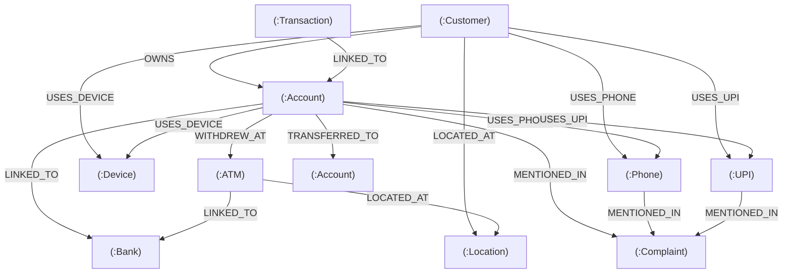

# Neo4j Graph Intelligence Layer

The **Graph Intelligence Layer** provides high-performance graph traversal, multi-hop money flow tracing, collusion cluster identification, and explainable evidentiary trails for cybercrime and financial fraud investigations.

The architecture is fully compatible with **Neo4j AuraDB** (Cloud) as well as self-hosted / Docker Neo4j instances.

---

## 1. Graph Entity & Relationship Model

The graph topology maps the 10 domain entities and 9 financial/cyber relationship types:



### Node Labels (10)
1. **`Customer`**: Citizen profile (`customer_id`, `synthetic_name`, `occupation`, `risk_category`).
2. **`Account`**: Bank account (`account_number`, `bank_name`, `ifsc_code`, `current_balance`, `is_mule`, `mule_tier`, `risk_score`).
3. **`Transaction`**: Immutable transfer record (`transaction_id`, `amount`, `rail_type`, `timestamp`, `is_fraud`, `pattern_type`).
4. **`Complaint`**: NCRP/1930 incident (`acknowledgement_no`, `category`, `reported_loss_amount`, `reported_date`).
5. **`UPI`**: Virtual Payment Address (`vpa`, `psp_handle`, `is_suspicious`, `status`).
6. **`Phone`**: Mobile SIM subscriber (`phone_number`, `operator`, `circle`, `is_suspect`).
7. **`Device`**: Terminal / phone hardware (`device_id`, `device_model`, `os_version`, `ip_address`, `is_shared_device`).
8. **`Bank`**: Financial institution (`bank_code`, `bank_name`, `bank_type`).
9. **`ATM`**: Cash switch kiosk terminal (`atm_id`, `terminal_model`, `location_id`).
10. **`Location`**: Geo-district / hotspot node (`location_id`, `city`, `state`, `pincode`, `latitude`, `longitude`, `is_cyber_hotspot`).

### Relationships (9)
* **`OWNS`**: `(:Customer)-[:OWNS]->(:Account)`
* **`TRANSFERRED_TO`**: `(:Account)-[:TRANSFERRED_TO {amount, txn_id, timestamp, rail_type, is_suspicious}]->(:Account)`
* **`USES_UPI`**: `(:Customer|Account)-[:USES_UPI]->(:UPI)`
* **`USES_PHONE`**: `(:Customer|Account)-[:USES_PHONE]->(:Phone)`
* **`USES_DEVICE`**: `(:Customer|Account)-[:USES_DEVICE]->(:Device)`
* **`WITHDREW_AT`**: `(:Account)-[:WITHDREW_AT {amount, txn_id, timestamp, rapid_cashout}]->(:ATM)`
* **`LOCATED_AT`**: `(:Customer|ATM)-[:LOCATED_AT]->(:Location)`
* **`MENTIONED_IN`**: `(:Account|Phone|UPI)-[:MENTIONED_IN]->(:Complaint)`
* **`LINKED_TO`**: `(:Account|ATM)-[:LINKED_TO]->(:Bank)`, `(:Transaction)-[:LINKED_TO]->(:Account)`

---

## 2. Neo4j Aura Compatibility

All Cypher DDL statements use Neo4j 5.x / Aura-compatible syntax:
* **Uniqueness Constraints**:
  ```cypher
  CREATE CONSTRAINT customer_id_unique IF NOT EXISTS FOR (c:Customer) REQUIRE c.customer_id IS UNIQUE;
  CREATE CONSTRAINT account_number_unique IF NOT EXISTS FOR (a:Account) REQUIRE a.account_number IS UNIQUE;
  CREATE CONSTRAINT transaction_id_unique IF NOT EXISTS FOR (t:Transaction) REQUIRE t.transaction_id IS UNIQUE;
  CREATE CONSTRAINT complaint_ack_unique IF NOT EXISTS FOR (cmp:Complaint) REQUIRE cmp.acknowledgement_no IS UNIQUE;
  CREATE CONSTRAINT upi_vpa_unique IF NOT EXISTS FOR (u:UPI) REQUIRE u.vpa IS UNIQUE;
  CREATE CONSTRAINT phone_number_unique IF NOT EXISTS FOR (p:Phone) REQUIRE p.phone_number IS UNIQUE;
  CREATE CONSTRAINT device_id_unique IF NOT EXISTS FOR (d:Device) REQUIRE d.device_id IS UNIQUE;
  CREATE CONSTRAINT bank_code_unique IF NOT EXISTS FOR (b:Bank) REQUIRE b.bank_code IS UNIQUE;
  CREATE CONSTRAINT atm_id_unique IF NOT EXISTS FOR (atm:ATM) REQUIRE atm.atm_id IS UNIQUE;
  CREATE CONSTRAINT location_id_unique IF NOT EXISTS FOR (l:Location) REQUIRE l.location_id IS UNIQUE;
  ```
* **Property Indexes**:
  ```cypher
  CREATE INDEX account_mule_idx IF NOT EXISTS FOR (a:Account) ON (a.is_mule, a.mule_tier);
  CREATE INDEX transaction_ts_idx IF NOT EXISTS FOR (t:Transaction) ON (t.timestamp);
  CREATE INDEX transaction_fraud_idx IF NOT EXISTS FOR (t:Transaction) ON (t.is_fraud);
  CREATE INDEX complaint_category_idx IF NOT EXISTS FOR (cmp:Complaint) ON (cmp.category);
  CREATE INDEX location_city_state_idx IF NOT EXISTS FOR (l:Location) ON (l.city, l.state);
  ```

---

## 3. High-Throughput ETL Pipeline

The ETL pipeline ([`graph/etl/loader.py`](file:///Users/ronitsingh/Anti/SIH/graph/etl/loader.py)) parses the synthetic datasets and loads them into Neo4j in parameterized `UNWIND $batch AS row` transactions.

### Running the ETL Pipeline:
```bash
python -m graph.etl.loader --data-dir data/synthetic --batch-size 1000
```

---

## 4. Curated Investigation Cypher Queries & Explainable Evidence

Located in [`graph/queries/investigation_queries.py`](file:///Users/ronitsingh/Anti/SIH/graph/queries/investigation_queries.py) and wrapped by [`GraphInvestigationService`](file:///Users/ronitsingh/Anti/SIH/graph/services/investigation_service.py):

### 1. Find Accounts Connected to an Account
Traverses direct financial inflows/outflows, as well as shared infrastructure (Device, Phone, UPI).
```python
results = await service.find_connected_accounts(account_number="SYN1000000042", limit=50)
```
* **Explainable Output**: Connection type, hop distance, shared hardware ID, cumulative volume, transaction count, mule classification, and natural language summary.

### 2. Find Transaction Chains
Discovers directed money laundering chains (2 to 5 hops) where funds are layered rapidly across mule accounts.
```python
chains = await service.find_transaction_chains(account_number="SYN1000000018", min_amount=5000.0)
```
* **Explainable Output**: Ordered node sequence, hop count, bottleneck hop amount, duration in seconds, and velocity classification (`RAPID_PASSTHROUGH`, `MEDIUM_VELOCITY`).

### 3. Find High-Degree Accounts (Funnel & Dispersal Hubs)
Computes graph in-degree, out-degree, unique senders, and unique recipients.
```python
hubs = await service.find_high_degree_accounts(min_degree=4, limit=20)
```
* **Explainable Output**: Hub typology (`FUNNEL_COLLECTOR`, `DISPERSION_HUB`, `HIGH_VELOCITY_PASSTHROUGH`), total credit/debit volume, and structural explanation.

### 4. Find Suspicious Account Clusters
Identifies collusion rings where multiple accounts share physical devices, phone numbers, or participate in circular money flow loops.
```python
clusters = await service.find_suspicious_clusters(limit=25)
```
* **Explainable Output**: Shared hardware IMEI / device ID, member account numbers, combined volume, and calculated syndicate risk score.

### 5. Find Cash-Out Paths
Identifies paths where funds pass through mule accounts and terminate in an ATM withdrawal.
```python
paths = await service.find_cash_out_paths(account_number="SYN1000000025")
```
* **Explainable Output**: Intermediary mule sequence, terminal cashout account, ATM terminal ID, city/location, cash amount, and rapid cash-out indicators.

### 6. Find Accounts Connected to Complaints
Maps citizen complaints directly to suspect accounts (depth 0) and downstream layer-1 / layer-2 beneficiaries.
```python
complaints = await service.find_accounts_connected_to_complaints(category="digital arrest scam", min_loss=50000.0)
```
* **Explainable Output**: Citizen acknowledgement number, victim loss amount, connected account, connection depth, and investigation trail.

### 7. Find Shortest Suspicious Paths
Calculates the shortest money flow path between two specific accounts.
```python
path = await service.find_shortest_suspicious_path("SYN1000000010", "SYN1000000049")
```
* **Explainable Output**: Hop count, traversed nodes, edge details (RRNs, amounts, rails), and suspicion flags.
