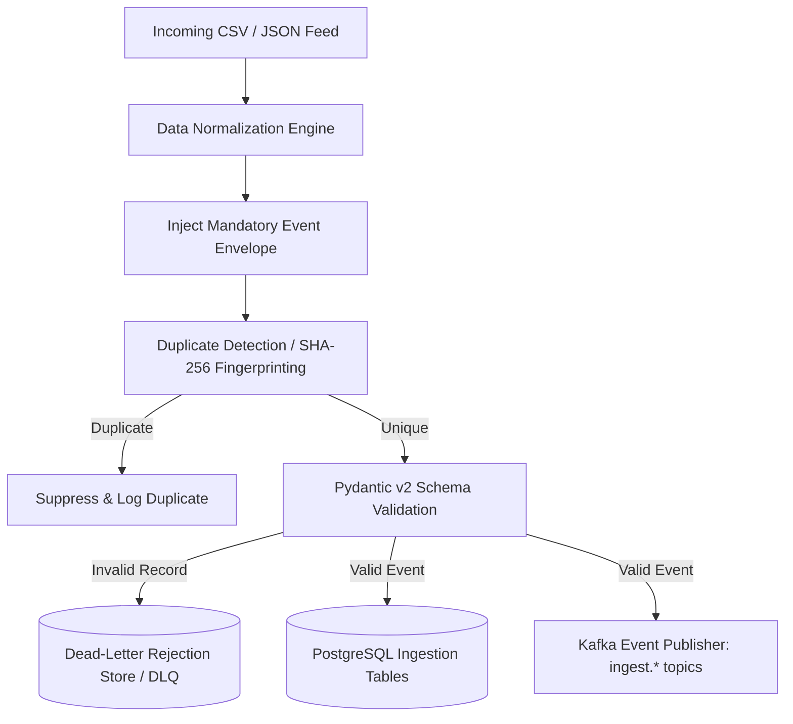

# CyberShield Data Ingestion Service
> **Independently Deployable Real-Time & Batch Data Ingestion Microservice**  
> *Python 3.12 | FastAPI | Pydantic v2 | Apache Kafka | PostgreSQL*

---

## 1. Overview
The Data Ingestion Service processes high-velocity, heterogeneous cybercrime and banking telemetry from diverse external stakeholders:
- **NCRP & 1930 Helpline Citizen Reports** (Batch CSV & JSON feeds)
- **Indian Payment Rails Telemetry** (UPI, IMPS, NEFT, RTGS streams)
- **Core Banking Systems (CBS)** (Account creation and balance updates)
- **ATM Terminal Switches** (Physical terminal cash withdrawals and rapid cashouts)
- **Threat Intelligence Feeds** (Automated fraud detection alert triggers)

---

## 2. Ingestion Pipeline Lifecycle



---

## 3. Mandatory Event Envelope
Every event accepted by the pipeline is guaranteed to contain the following metadata envelope:

| Header Attribute | Type | Description | Example |
|---|---|---|---|
| `event_id` | UUID | Globally unique event identifier | `9b1deb4d-3b7d-4bad-9bdd-2b0d7b3dcb6d` |
| `event_timestamp` | ISO-8601 (UTC) | Time event occurred at source system | `2024-08-15T10:14:32Z` |
| `source` | String | Origin identifier (e.g., `NCRP_1930`, `UPI_GATEWAY`) | `UPI_GATEWAY` |
| `schema_version` | String | Semantic version of the schema | `1.0.0` |
| `ingestion_timestamp`| ISO-8601 (UTC) | Timestamp when accepted by ingestor | `2024-08-15T10:14:33.128Z` |

---

## 4. Supported Event Schemas

1. **`TransactionEvent`**: Financial transactions across UPI, IMPS, NEFT, RTGS, and ATM rails.
2. **`AccountEvent`**: Bank accounts with strict IFSC code regex validation (`^[A-Z]{4}0[A-Z0-9]{6}$`) and tier labeling.
3. **`ComplaintEvent`**: NCRP / 1930 incident reports with structured entity linkages and narrative text.
4. **`ATMEvent`**: ATM cash withdrawal interactions and rapid cash-out indicators.
5. **`BankEvent`**: Registered banking institutions and nodal officer emergency contacts.
6. **`AlertEvent`**: Behavioral fraud triggers (`RAPID_VELOCITY`, `MULE_CHAIN`, `RAPID_CASHOUT`, etc.).

---

## 5. Dead-Letter Queue & Rejection Handling
Invalid records are **strictly rejected and segregated** from the main pipeline. They are never discarded silently:
1. Recorded in the `ingestion_rejections` database store with:
   - `rejection_id`
   - `source`
   - `entity_type`
   - `raw_payload`
   - `error_type` (e.g. `SCHEMA_VALIDATION_ERROR`, `MALFORMED_JSON_PAYLOAD`)
   - `error_details` (granular Pydantic field-level error messages)
   - `rejection_timestamp`
2. Appended to the local JSON Lines forensic audit log at `data/dead_letter/rejections.jsonl`.
3. Published to the Kafka dead-letter topic `ingest.dead_letter`.
4. Inspectable in real time via `GET /api/v1/ingest/rejections`.

---

## 6. How to Run Independently

### Option A: Local Uvicorn Server (Port 8001)
```bash
# From workspace root
uvicorn ingestion.app.main:app --host 127.0.0.1 --port 8001 --reload
```

### Option B: Docker Container Deployment
```bash
# Build the container
docker build -t cybershield-ingestion:latest -f ingestion/Dockerfile .

# Run the independent ingestion container
docker run -p 8001:8001 -e KAFKA_BOOTSTRAP_SERVERS=localhost:9092 cybershield-ingestion:latest
```

---

## 7. REST API Endpoints & Sample Calls

### Ingest Single Transaction
```bash
curl -X POST http://127.0.0.1:8001/api/v1/ingest/transactions \
  -H "Content-Type: application/json" \
  -d '{
    "source": "UPI_SWITCH_LIVE",
    "transaction_id": "TXN_998142",
    "sender_account_number": "SYN1000000042",
    "receiver_account_number": "SYN1000000084",
    "sender_upi_id": "victim@synaxis",
    "receiver_upi_id": "mule@synaxis",
    "amount": 45000.00,
    "transaction_type": "TRANSFER",
    "payment_channel": "UPI"
  }'
```

### Ingest Batch CSV via Upload
```bash
curl -X POST http://127.0.0.1:8001/api/v1/ingest/csv/complaint \
  -F "file=@data/synthetic/complaints/complaints.csv"
```

### Inspect Dead-Letter Rejections
```bash
curl http://127.0.0.1:8001/api/v1/ingest/rejections?limit=10
```
